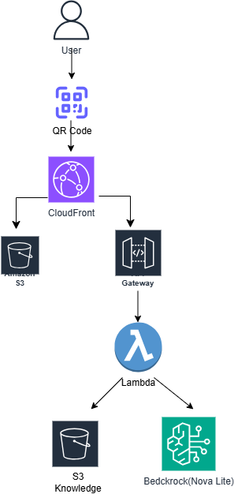
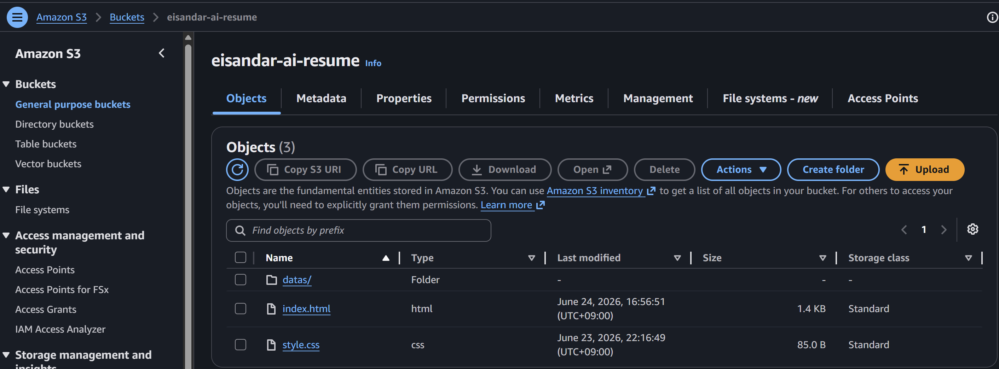
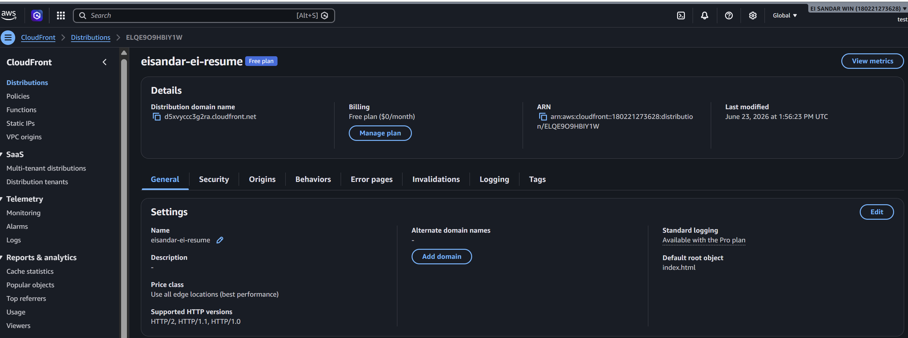
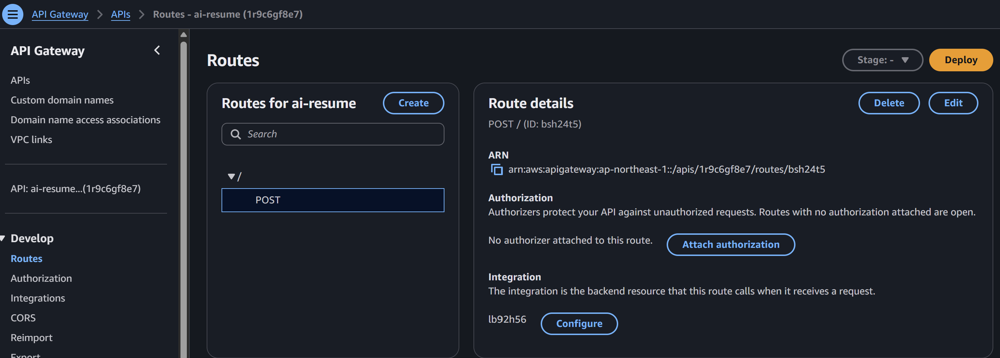
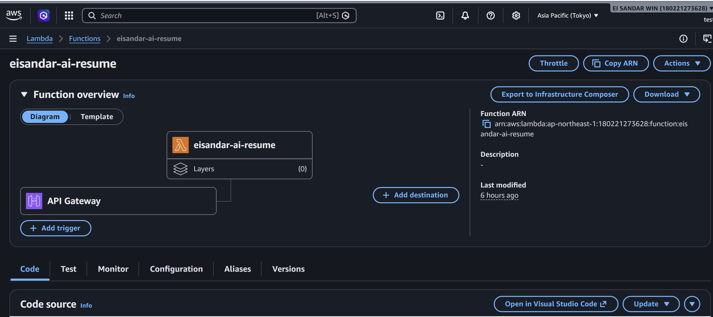
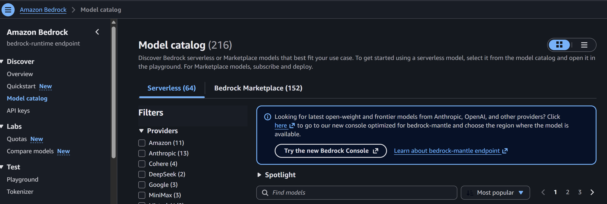

## AI Resume with chatbot using Amazon Bedrock

## Project Overview

AI Resume Assistant is a serverless portfolio application built on AWS that allows recruiters to:

- View my online resume and portfolio
- Download my English and Japanese CV
- Interact with an AI-powered chatbot
- Ask questions about my skills, experience, certifications, and projects

The solution is designed using a fully serverless architecture and leverages Amazon Bedrock for Generative AI capabilities.

## Architecture

Click here to view Configuration and Results

  
| Service | Purpose | Screenshot |
|-------------|:--------|------------|
| **Amazon S3**   | Static website hosting and resume storage |  |
| **CloudFront** | Global content delivery and HTTPS |  |
| **Amazon API Gateway (HTTP API)** | API endpoint for chatbot requests |  |
| **AWS Lambda** | Serverless backend processing |  |
| **Amazon Bedrock** | Generative AI chatbot using Nova Lite |  |

## Website
 

## Features

### Resume Portfolio Website

- Responsive portfolio website
- English Resume Download
- Japanese Resume Download
- QR Code access

### AI Chatbot

Recruiters can ask questions such as:

- Tell me about your experience.
- What AWS certifications do you have?
- What testing tools have you used?
- Describe your cloud projects.
- What programming languages do you know?

### Serverless Architecture

- No EC2 servers required
- Fully managed AWS services
- Low operational cost
- Scalable architecture

---

## Technical Stack

### Frontend

- HTML
- CSS
- JavaScript

### Backend

- AWS Lambda
- Amazon API Gateway

### AI

- Amazon Bedrock
- Amazon Nova Lite

### Cloud

- Amazon S3
- Amazon CloudFront

---

